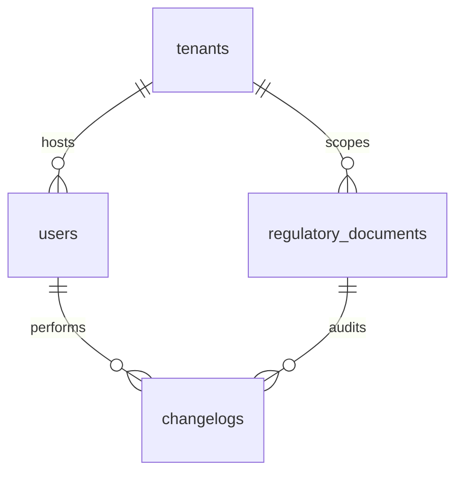

# Database Schema Documentation

This document describes the structure of the SQLite database (`data.db`) used for the multi-tenant PCCC document portal. The project utilizes a relational model with **4 tables** to enforce multi-tenant isolation, authorization controls, document metadata versioning, and change audits.

---

## Entity-Relationship Diagram

Below is the visual relationship schema between the entities, represented via a Mermaid diagram:

---

## Table Schemas

### 1. `tenants`
This table represents the isolated logical tenants (e.g., individual fire safety departments, provincial agencies). All data must belong to a specific tenant to ensure proper isolation.

| Column | Type | Nullable | Description |
| :--- | :--- | :--- | :--- |
| `id` (PK) | `VARCHAR(36)` | No | Unique UUID generated for each tenant organization. |
| `ten_co_quan` | `VARCHAR(255)` | No | The full Vietnamese display name of the agency/department. |
| `ma_tenant` | `VARCHAR(50)` | No | An alphanumeric unique code identifier (e.g. `PCCC_CUC`, `PCCC_HN`). |

---

### 2. `users`
Represents user profiles registered under a specific tenant. User roles control document operations permissions.

| Column | Type | Nullable | Description |
| :--- | :--- | :--- | :--- |
| `id` (PK) | `VARCHAR(36)` | No | Unique user UUID. |
| `ho_ten` | `VARCHAR(255)` | No | Full name of the user (e.g., Nguyễn Văn A). |
| `vai_tro` | `VARCHAR(20)` | No | Role Enum: `ADMIN`, `THAM_TRA_VIEN` (Inspector), `CHUYEN_GIA_PHE_DUYET` (Approver). |
| `tenant_id` (FK) | `VARCHAR(36)` | No | References `tenants.id` indicating their home organization. |

> [!NOTE]
> Authorization rules:
> *   `ADMIN` and `THAM_TRA_VIEN` can publish/replace PDF documents (`CREATE_DOCUMENT`, `REPLACE_DOCUMENT`).
> *   `ADMIN` and `CHUYEN_GIA_PHE_DUYET` can review and transition document states (`APPROVE_DOCUMENT`, `ARCHIVE_DOCUMENT`).

---

### 3. `regulatory_documents`
Represents the metadata of fire safety guidelines, national regulations, and codes of practice.

| Column | Type | Nullable | Description |
| :--- | :--- | :--- | :--- |
| `id` (PK) | `VARCHAR(36)` | No | Unique document UUID. |
| `ma_hieu` | `VARCHAR(100)` | No | Document code index (e.g., `QCVN 06:2022/BXD`). |
| `ten_day_du` | `VARCHAR(500)` | No | Full legal title of the regulation. |
| `co_quan_ban_hanh`| `VARCHAR(255)` | No | Legal agency responsible for releasing the document. |
| `ngay_ban_hanh` | `DATE` | No | Date released in standard `YYYY-MM-DD` layout. |
| `ngay_hieu_luc` | `DATE` | No | Date the document becomes legally active. |
| `trang_thai` | `VARCHAR(18)` | No | Status Enum: `CHO_XU_LY_NOI_DUNG` (Pending), `HIEU_LUC` (Active), `HET_HIEU_LUC` (Archived), `BI_THAY_THE` (Superseded). |
| `file_url` | `VARCHAR(1024)`| Yes | Path to local uploaded PDF source (e.g. `stored_files/<tenant_id>/<file>.pdf`). |
| `file_checksum` | `VARCHAR(64)` | Yes | SHA-256 integrity hash of the uploaded PDF. |
| `tenant_id` (FK) | `VARCHAR(36)` | No | References `tenants.id` ensuring the record belongs only to this tenant scope. |
| `version` | `INTEGER` | No | Current document version, starts at 1, increments on PDF updates. |

---

### 4. `changelogs`
Stores audit trails generated via the Observer pattern for state transitions or upload replacements.

| Column | Type | Nullable | Description |
| :--- | :--- | :--- | :--- |
| `id` (PK) | `VARCHAR(36)` | No | Unique log item UUID. |
| `document_id` (FK)| `VARCHAR(36)` | No | References `regulatory_documents.id`. Cascade deleted if document is deleted. |
| `action` | `VARCHAR(50)` | No | Action type tag: `CREATE`, `UPDATE`, `REPLACE`, `STATUS_CHANGE`. |
| `performed_by` (FK)| `VARCHAR(36)`| Yes | References `users.id` to identify who executed the action. |
| `performed_at` | `DATETIME` | No | Precise UTC timestamp of the log event. |
| `detail` | `VARCHAR(1000)`| Yes | Multi-line textual summary of the changes made. |
